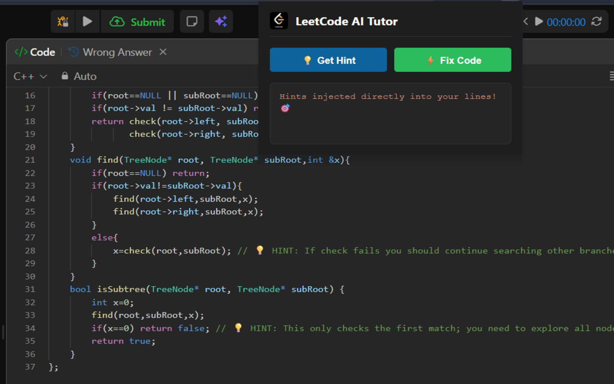
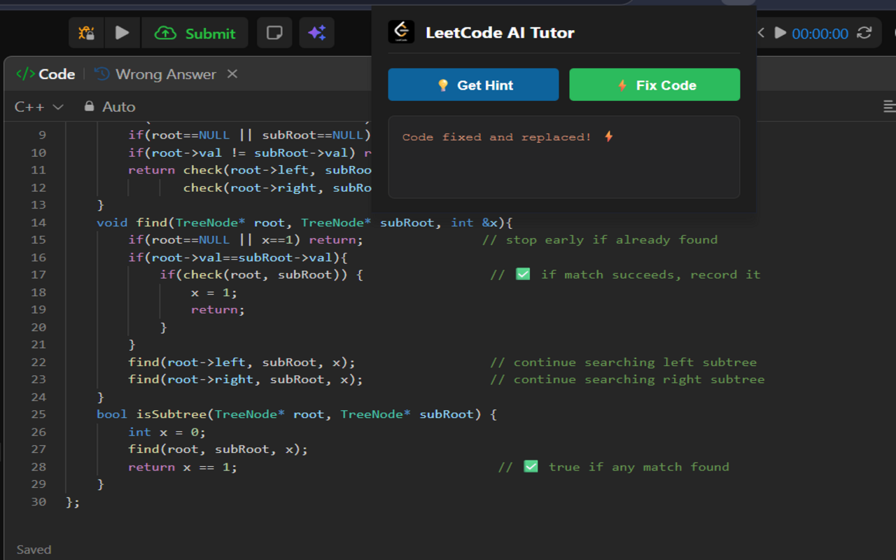

# LeetCode AI Tutor 🤖🚀


**LeetCode AI Tutor** is a browser extension designed to act as a personal mentor for Data Structures and Algorithms (DSA). Instead of providing a full solution immediately, it analyzes your code and guides you toward the answer through step-by-step hints and minimal logic fixes directly within the LeetCode editor.

## ✨ Features

* **💡 Smart Hints:** Detects logic errors and injects non-spoilery debugging advice as inline comments (`// 💡 HINT:`).
* **⚡ Minimal Fixes:** Applies the smallest possible code change to fix a failing solution, accompanied by an explanation of the fix.
* **🎨 Native Integration:** Designed to work seamlessly with LeetCode’s Monaco editor and dark mode aesthetic.
* **🧠 LLM Powered:** Integrates with advanced Large Language Models via the **OpenRouter API** for high-quality, context-aware coding assistance.

## 🛠️ Tech Stack

* **Languages:** JavaScript (ES6+), C++ (Problem context), HTML5, CSS3.
* **Extension Architecture:** Manifest V3, `chrome.scripting`, `chrome.tabs`.
* **AI Integration:** OpenRouter API.

## 📸 Screenshots

| Feature: Get Hint | Feature: Fix Code |
| :--- | :--- |
|  |  |

## 🚀 Installation & Setup

### 1. Clone the Repository
```bash
git clone [https://github.com/Yuv-Raj-15/LeetCode-AI-Tutor.git](https://github.com/Yuv-Raj-15/LeetCode-AI-Tutor.git)
cd leetcode-ai-tutor


2. Configure Your API Key
Open app.js and locate the configuration section at the top. Replace the placeholder with your OpenRouter API Key:

const OPENROUTER_API_KEY = "YOUR_KEY_HERE";

3. Load into your Browser
Open Microsoft Edge or Google Chrome.

Navigate to the extensions management page (edge://extensions or chrome://extensions).

Enable Developer mode using the toggle in the top-right corner.

Click Load unpacked and select the root folder of this project.

🛡️ Security & Privacy
This extension does not collect, store, or share any personal user information. Code snippets are transmitted to the OpenRouter API only for the purpose of generating debugging hints and are not retained.

👨‍💻 About the Developer
Yuvraj Rauniyar
Computer Science and Engineering Student, NIT Warangal
Frontend Developer & DSA Enthusiast